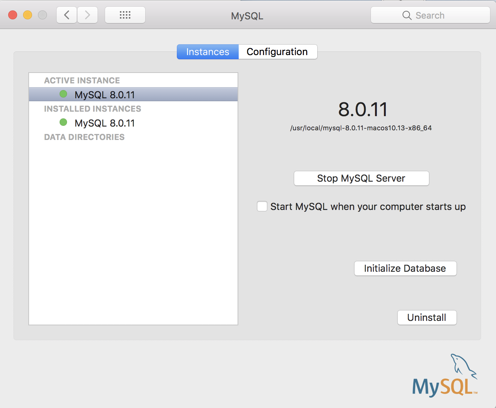

# JDBC Connection Test

## MySQL Install

- Download [MySQL Community Server](https://dev.mysql.com/downloads/mysql/)


- Check the MySQL Server activated



## JDBC Driver for MySQL

- Download [JDBC Connector Driver](https://dev.mysql.com/downloads/connector/j/)


- Click **Edit...** button the below image to add `mysql-connect-java-8.0.11.jar` in the system library


- Add the jar file via the  **Add External JARs...** button


## Connection Test

- Source Code for JDBC Connection Test
  - https://github.com/jeongwhanchoi/jdbc-test/blob/master/src/jdbcTest/jdbcTest.java
- MySQL Login

```shell
cd /usr/local/mysql/bin

./mysql -u root -p
```


- Create MySQL Database
  - `create database demo;`
    - Create **demo** database
  - `show databases;`
    - Check databases


### JDBC Connecion Success


---

## Breakthrough

 - KST Error
     - `serverTimeszone=Asia/Seoul`
   - SSL connection Error
     - https://stackoverflow.com/questions/34189756/warning-about-ssl-connection-when-connecting-to-mysql-database

  